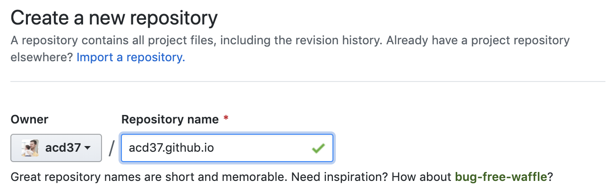
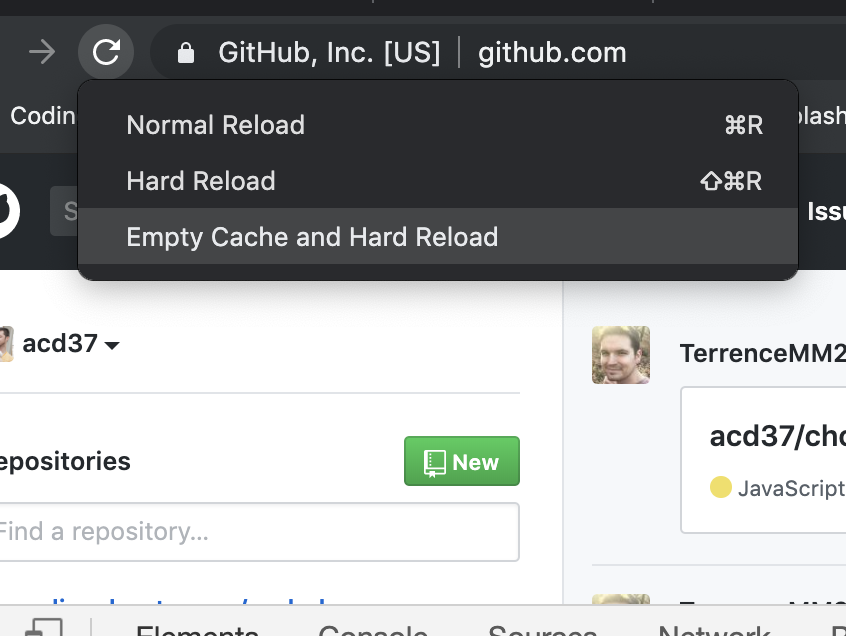

[Back to Contents](https://github.com/coding-boot-camp/cs-technical-curriculum/tree/master/async-content)

# Lesson Fourteen: Deployment

Deployment is an important skill to master if you are wanting to showcase your applications to potential employers.
When deciding where to deploy your applications, you need to understand the kind of code you are deploying. Consider the following questions:

- Does you app have server-side code (NodeJS, Python etc.)?
  - You need to use Heroku

- Does your app consist of static content (`.html`, `.css`. and client-side `.js` files)?
  - You can deploy using GitHub pages

Once you've decided where you need to deploy, take a look at the respective guides and common troubleshooting steps.

## Heroku

## GitHub Pages

GitHub Pages allows you to create two different types of sites:

- Personal/organization sites for your account
- Sites that are specific to a project/repository

### Personal or Organization Site
You can only have one of these for each Github account. We recommend using this for your developer portfolio!

- Create a new repository on GitHub called _username_.github.io where _username_ is your account name on GitHub.

- Open up Git Bash or Terminal on your computer. Navigate into the folder that you would like to store your project in and then clone the repository you just created.
- Within this new folder, add an HTML file called `index.html` which contains the code for the website you would like to publish. It is _important_ that you call it `index.html` or GitHub Pages won't know where to look.
- Add, commit, and push your changes to the repository...that's it! 
- Navigate to the website on your browser to verify that the site is there.

*Common Troubleshooting Steps*
Page not showing up?
- Be aware it can take 10 to 20 minutes after the initial deployment for your site to show up.
- Is your main file called `index.html`? Check for spelling errors
- Is your repository called _username_.github.io? Again, verify the spelling of your GitHub username against the name of the repository
- Clear your cache and hard reload the page
  - Open the inspector tools
  - Right click on the cirular refresh button
  - Hit `Empty Cache and Hard Reload`
  - 

## Watch

### GitHub Pages Deployment:

### Heroku Deployment:

## Solve

No other challenges for this module